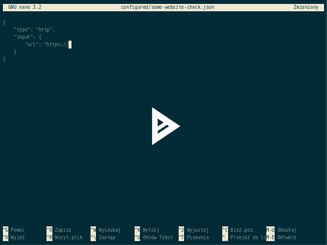

Quick start
===========

To monitor applications and the infrastructure parts you need to configure **checks**.
A configured check is a json file that defines a method name (script to be used) and the input parameters.
Each check is executed when your external monitoring software invokes the HTTP endpoint, or when you execute the shell command.

Infracheck can work as a HTTP endpoint responding with JSON, or as a console command.

1. Requirements
---------------

You need to install all requirements manually if you decide not to use a docker container.

**Requirements:**

- Python 3.7+
- OpenSSH Client
- sshpass (for SSH checks)
- whois (for domain checks)
- mysql-client (for MySQL checks)
- postgresql-client (for PostgreSQL checks)
- docker client (for Docker checks)
- curl

**Python package requirements:**

.. literalinclude:: ../../requirements.txt

2. Structure
------------

You need to create a **project structure** from following template:

.. code:: yaml

    - checks/
        - http
        - smtp
        - port
    - configured/
        - redis
        - duckduckgo_http
        - smtp_is_alive

In **checks** there should be scripts that will take parameters as environment variables, process and give results.
For simpler cases you may not need to define any scripts, just configure pre-defined ones.

**configured** should contain your actual use cases, for example "duckduckgo_http" from above example could use "http" check with url "https://duckduckgo.com" as a parameter.

3. Configuring a first check
----------------------------

Let's assume that we need to check if a page contains given keyword, and does not contain another defined one.
Following check will use **curl** to fetch page content.

Test cases:

- If page will not load, then THE CHECK RETURNS FAILURE
- If page contains "Server error", then THE CHECK RETURNS FAILURE
- If page will not contain keyword "iwa", then THE CHECK RETURNS FAILURE
- If page loads properly and contains "iwa" keyword, then THE CHECK RETURNS SUCCESS

.. code:: json

    {
        "type": "http",
        "input": {
            "url": "http://iwa-ait.org",
            "expect_keyword": "iwa",
            "not_expect_keyword": "Server error"
        }
    }

Hint: You can pass environment variables in parameters - see: :ref:`Templating` section.

4. Running checks
-----------------

**With Docker**

You can use a ready-to-use docker image **quay.io/riotkit/infracheck** or **quay.io/riotkit/infracheck** for ARM.
Please check `the list of available versions <https://quay.io/repository/riotkit/infracheck?tab=tags>`_.

The image will by default expose a HTTP endpoint.

.. _the list of available versions: https://quay.io/repository/riotkit/infracheck?tab=tags

.. code:: bash

    # create directory structure that will be present in "/data" inside container (see one of previous steps about the structure)
    mkdir checks configured

    sudo docker run --name infracheck -p 8000:8000 -v $(pwd):/data -d --rm quay.io/riotkit/infracheck:v2.0-x86_64 \
        --directory=/data --server-path-prefix=/your-secret-code-there

    # now test it
    curl http://localhost:8000/your-secret-code-there/

**List of supported environment variables:**

- REFRESH_TIME=120
- CHECK_TIMEOUT=120
- WAIT_TIME=0

**Without Docker**

.. code:: bash

    git clone https://github.com/riotkit-org/infracheck
    cd infracheck
    rkd :install

    # run checks in the shell
    infracheck --directory=/your-project-directory-path-there --no-server

    # run the application with webserver and background worker
    infracheck --directory=/your-project-directory-path-there --server-port=8000 --refresh-time=120 --log-level=info

**Using PIP**

.. code:: bash

    sudo pip install infracheck

    # run checks in the shell
    infracheck --directory=/your-project-directory-path-there --no-server

    # run the application with webserver and background worker
    infracheck --directory=/your-project-directory-path-there --server-port=8000 --refresh-time=120 --log-level=info

Advanced
--------

**Setting timeout per check:** Set :code:`INFRACHECK_TIMEOUT` environment variable in json file to adjust timeout for given check.
